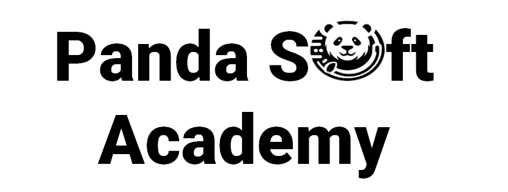

# Reto de la Academia Padasoft: C# Nivel 1- Ejercios  🚀

## Descripción del reto:
Es una serie de 4 proyecto pensado para practicar y desarrollar la  lógica de programación, junto con
lo aprendido sobre constante, variables, operadores y condicionales

### Proyecto 1- Calculadora de IMC (Indice de masa corporal):🚀

Pide al usuario su peso (en kilogramos) y altura (en metros). Calcula su índice de masa corporal (IMC) y muestra un mensaje indicando si está por debajo del peso ideal, en el peso ideal, con sobrepeso o obeso.

### Proyecto 2- Calculadora simple:🚀🚀

Pide al usuario dos números y muestra el resultado de sumar, restar, multiplicar y dividir esos números.

### Proyecto 3- Área y perímetro:🚀🚀🚀
Pide al usuario las dimensiones de un rectángulo (base y altura) y calcula su área y perímetro.

### Proyecto 4- Signo zodiacal:🚀🚀🚀🚀
Pide al usuario su fecha de nacimiento (día y mes) y muestra su signo zodiacal (puedes usar una serie de if, else if para determinar el signo).

### Entrega:🚀

Los estudiantes deberán Desarrollar 4 proyectos de tipo Console con el nombre de cada uno de los restos 
en c# y subirlos a github en 4 commit separados (1 por cada reto), todos en un mismo repositorio, enviar la URL del repositorio por el aula virtual de Moodle 🎨✨